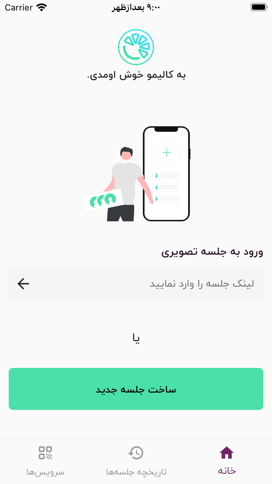
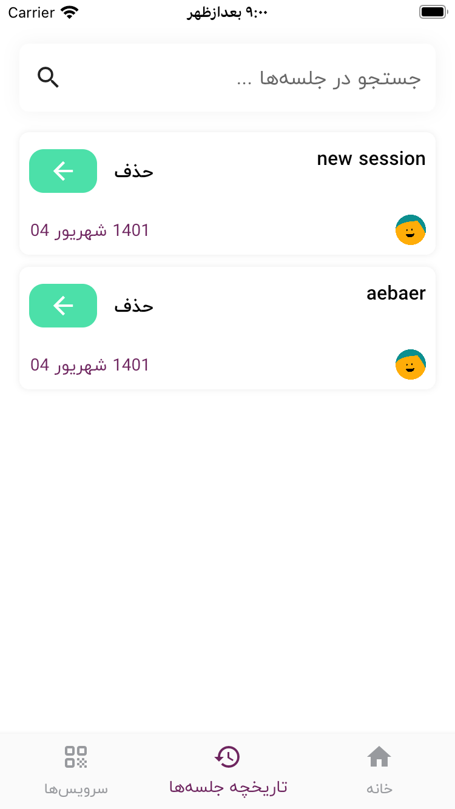
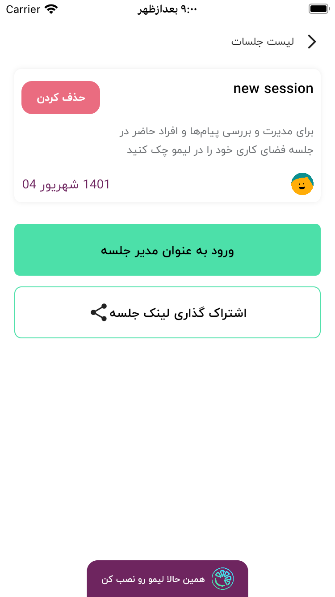
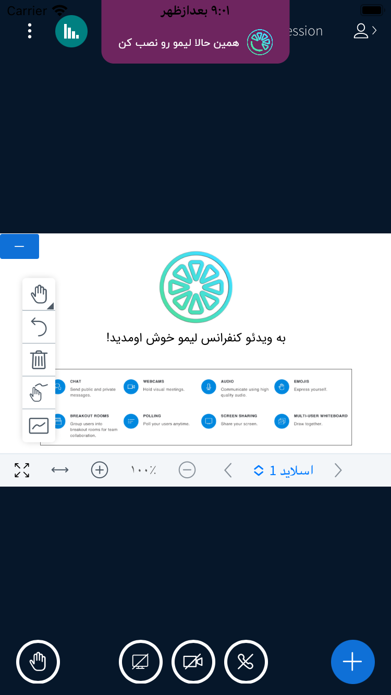
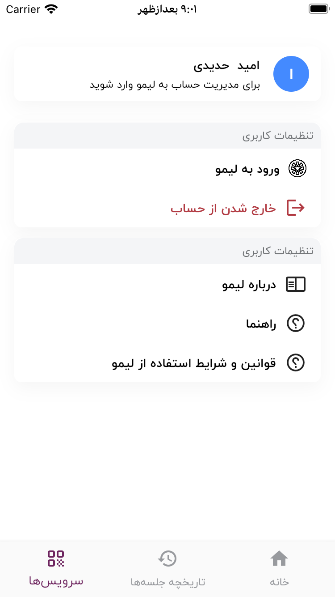

# callimoo

**Online meeting and conference software.**

Suitable for organizations, schools and offices that need to hold internet meetings in audio and video format and want them to be presented in the form of a classroom or an official meeting.
Power from [Limoo](https://limoo.im)

## Futures

connect audio & video sessions in bbb platform
show call history
share and inter the confrence link
manage Limmo account in callimoo

## Screenshots
     

## Social media

  

for view the other stoies, follow my instagram page 
